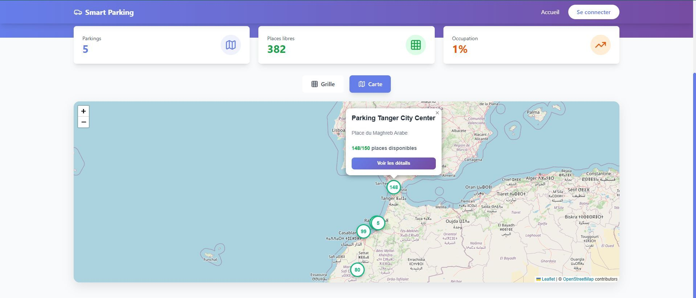
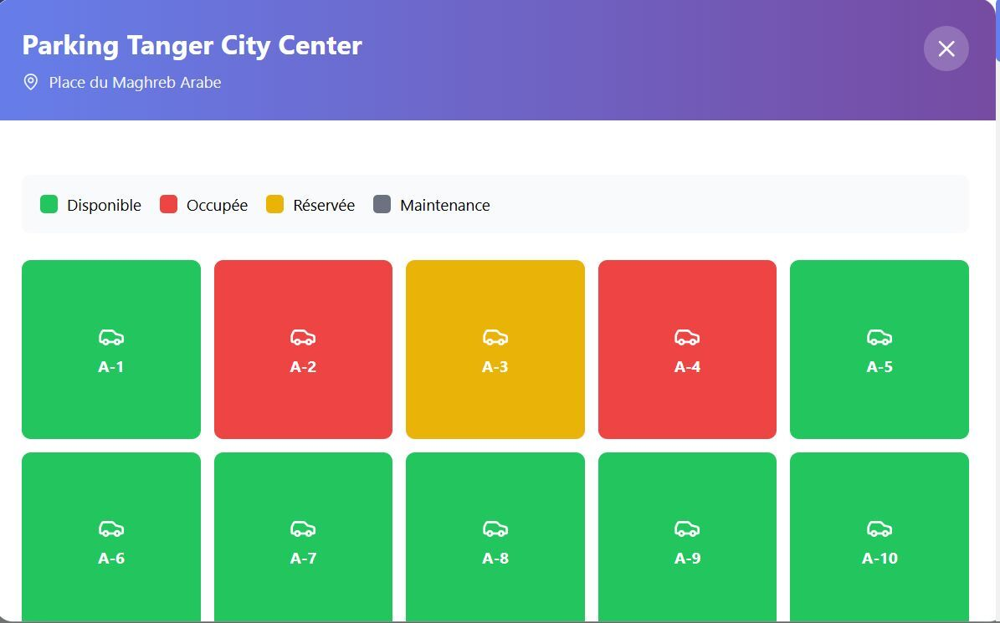
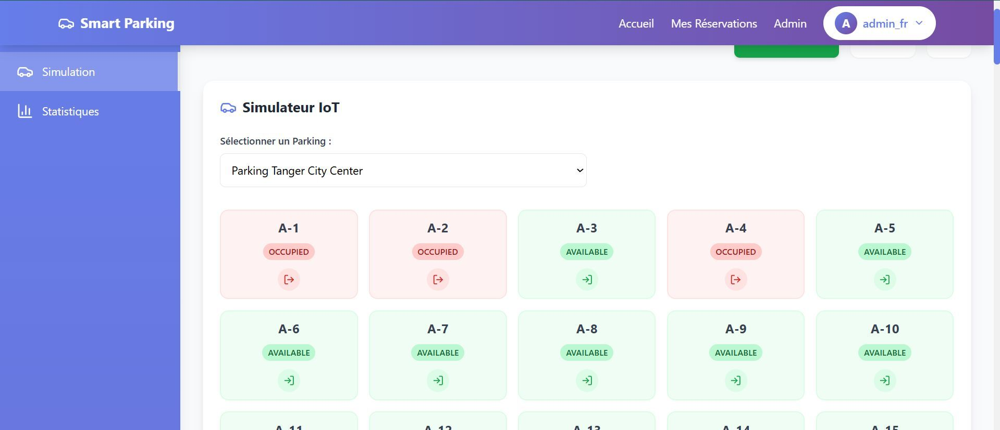

# 🚗 Smart Parking RMI System


Bienvenue sur le dépôt global du projet **Smart Parking RMI System**. Ce projet est une solution avancée de gestion de parking intelligent, utilisant une architecture distribuée basée sur **Java RMI**, un backend robuste avec **Spring Boot** et un frontend dynamique avec **React**.

---

## 📑 Table des Matières
- [Architecture Globale](#-architecture-globale)
- [Fonctionnalités](#-fonctionnalités-principales)
- [Technologies Utilisées](#-technologies)
- [Captures d'écran](#-captures-décran)
- [Démarrage Rapide](#-démarrage-rapide)
- [Crédits](#-crédits)

---

## 🏗 Architecture Globale

Le système suit une architecture distribuée **Multi-Tiers** :
1.  **Frontend (SPA)** : Interface React moderne utilisant Tailwind CSS pour un design épuré.
2.  **Backend (API)** : Service Spring Boot gérant l'authentification (JWT) et servant de passerelle REST.
3.  **RMI Servers** : Serveurs Java RMI dédiés à la logique métier de gestion des parkings et des places en temps réel.
4.  **Data** : Persistance des données via MySQL.

### 🔙 Backend (Spring Boot)
Gère la sécurité, les utilisateurs et communique avec les serveurs RMI.
*   [Voir le dossier Backend](./backend/parking_rmi)

### 🖥️ Frontend (React)
Interface utilisateur réactive pour la visualisation des parkings et la gestion des réservations.
*   [Voir le dossier Frontend](./frontend)

### ⚙️ RMI Servers
Cœur du système distribué pour la gestion des services de parking.
*   [Voir le dossier RMI Servers](./rmi-servers/parking-rmi)

---

## 🔐 Fonctionnalités Principales

*   **Sécurité & Authentification** :
    *   Authentification sécurisée avec **JWT (JSON Web Tokens)**.
    *   Gestion des sessions utilisateurs.
*   **Gestion des Parkings** :
    *   Visualisation en temps réel de l'état des parkings.
    *   Ajout, modification et suppression de parkings et de places.
*   **Cartographie Intégrée** :
    *   Affichage des parkings sur une carte interactive via **Leaflet**.
*   **Analytiques & Tableaux de Bord** :
    *   Statistiques d'occupation visualisées avec **Recharts**.
*   **Architecture Distribuée** :
    *   Communication entre composants via **Java RMI** pour une haute disponibilité et modularité.

---

## 🛠 Technologies

### Backend & RMI Servers
*   **Langage** : Java 21 / 24
*   **Framework** : Spring Boot 3.4
*   **Communication** : Java RMI (Remote Method Invocation)
*   **Data** : Spring Data JPA, Hibernate, MySQL
*   **Sécurité** : Spring Security, JWT

### Frontend
*   **Framework** : React 19
*   **Styling** : Tailwind CSS
*   **Cartographie** : Leaflet / React Leaflet
*   **Graphiques** : Recharts
*   **Icônes** : Lucide React

---

## 📸 Captures d'écran

### Tableau de Bord & Statistiques


### Vue Carte Interactive


### Gestion des Parkings


### État des Places


### Interface Utilisateur


---

## 🚀 Démarrage Rapide

### Prérequis
*   **Java 21** ou supérieur
*   **Node.js** (v18+) & **NPM**
*   **MySQL**
*   **Maven**

### 1️⃣ Configuration de la Base de Données
Créez deux bases de données MySQL :
1. `parking_rmi_db` (pour le backend)
2. `parking_rmi_system` (pour le serveur RMI)

### 2️⃣ Lancement du Serveur RMI
1.  Naviguez dans le dossier du serveur RMI :
    ```bash
    cd rmi-servers/parking-rmi
    mvn spring-boot:run
    ```

### 3️⃣ Lancement du Backend
1.  Naviguez dans le dossier backend :
    ```bash
    cd backend/parking_rmi
    mvn spring-boot:run
    ```
    > API accessible sur : `http://localhost:8081`

### 4️⃣ Lancement du Frontend
1.  Installez les dépendances et lancez le serveur React :
    ```bash
    cd frontend
    npm install
    npm start
    ```
    > Application accessible sur : `http://localhost:3000`

---

## 📄 Licence

Ce projet est sous licence MIT © 2026 **Hakim HADDIOUI**.
